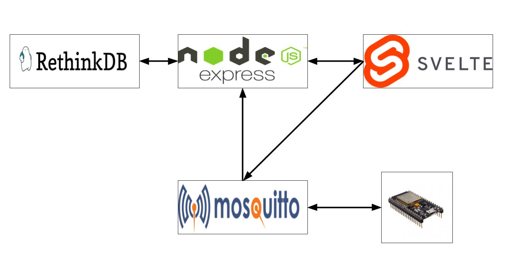
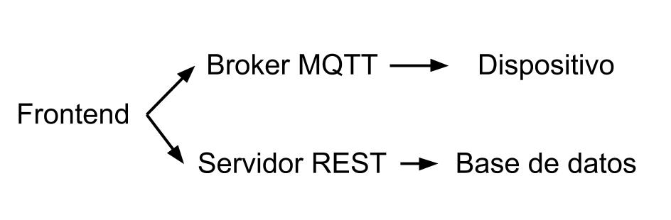
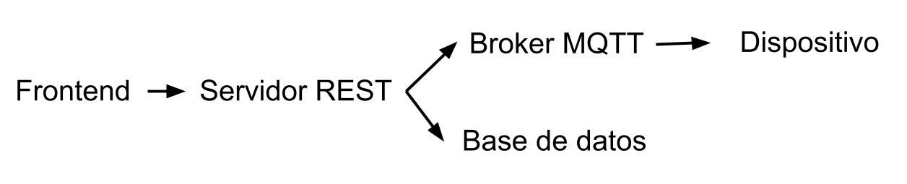
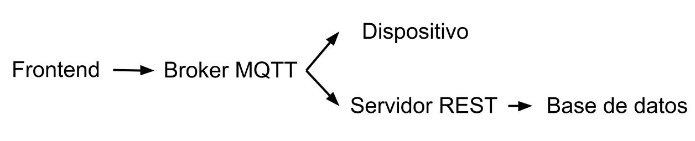
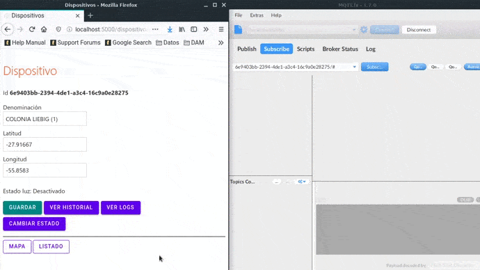

##### Autor:  Claudio Omar Biale - 2020

# Introducción

El proyecto corresponde al trabajo final de la asignatura **Desarrollo de aplicaciones para IOT** de la *Especialización en Internet de las Cosas* dictada en la *Facultad de Ingeniería* de la *Universidad de Buenos Aires*.

# Correr aplicación

Para ejecutar la aplicación debe descargar el repositorio de la rama `develop`.

En el directorio de descarga se ejecuta:

```
docker-compose up
```

Como paso previo se debe verificar que los siguientes puertos se encuentren disponibles:
- 8081 *(Rethinkdb)*
- 1883 *(Mosquitto)*
- 9001 *(Mosquitto)*
- 3000 *(Backend)*
- 5000 *(Frontend)*

Desde el navegador se debe acceder a `localhost:5000`.

# Arquitectura



- **RethinkDB**: base de datos documental utilizada para almacenar datos sobre los dispositivos.
- **Node.js**: funcionamiento de back-ends de `dispositivos` y `tiempos`.
- **Svelte**: framework utilizado para el front-end.
- **Mosquitto**: Broker MQTT.

Corren como nodos orquestados por `docker-compose` en una red denominada `tp-net` de tipo bridge. Ver [docker-compose.yml](./docker-compose.yml).

Aparte de ello, en la carpeta `nodo` se ha definido el código necesario para la funcionalidad en los dispositivos `ESP32` usando C++ para Arduino.

## Librerías utilizadas

Algunas de las librerías utilizadas son:
- **Leaflet**: mapas.
- **yul**: validaciones en formularios.
- **svelte-frappe-charts**: gráficos del dashboard.
- **Svelte Material UI**: componentes Svelte Material UI.
- **MQTT.js**: cliente MQTT para Node.js y navegadores *(dsde un navegador utiliza websockets)*.

## Comunicación usando webSockets

Para constatar la funcionalidad del uso de websockets se debe ver el archivo [Dispositivo.svelte](./frontend/src/componentes/Dispositivo.svelte).

Pasos:

- Defino el cliente de websockets:
    ```
    const cliente = mqtt.connect("ws://:9001");
    ```
- Método que se ejecuta al conectarse al destino:
    ```
    cliente.on("connect", () => {
		console.log("Cliente conectado a servidor MQTT");
		cliente.subscribe("#");
	});
    ```
- Método que se ejecuta si existen problemas al conectarse al destino:
    ```
	// en caso de error al comenzar
	cliente.on("error", (error) => {
		console.log(`Error al conectarse el cliente: ${error}`);
	});
    ```
- Función `cambiar()`, internamente enviá datos mediante el socket en `cliente.publish(...) {...}`:
    ```
	// cambio de estado
	async function cambiar() {
        let cambio;
		if (estado.ultimoEstado === "Activado") {
            estado.ultimoEstado = "Desactivado";
            cambio = "0";
		} else {
            estado.ultimoEstado = "Activado";
            cambio = "1";
		}
		// uso websocket mediante mqtt.js (lado cliente)
		cliente.publish(topico, cambio, { qos: 0 }, function (err) {
			if (err) {
				console.log(`Error al publicar ${topico}: ${err}`);
			}
		});
		// usando REST para base de datos
		logsServicio
			.agregarLog(estado)
			.then(() => location.replace(`/dispositivos/${dispositivo.id}`));
	}
    ```

En la función `cambiar()` se envía datos al broker y luego se envía un POST al servidor para almacenar el cambio en la base de datos, es decir:


 

Esto es una forma de trabajar, la otra es la siguiente:


 

La ultima opción es directamente usar el websocket para comunicarse con el broker MQTT y en el servidor que se encuentra escuchando por mensajes entrantes distinguir entre el mensaje de datos de sensores y el de cambio de un actuador, esto se debe modificar en [Mqtt.js](./backend-dispositivos/api/mqtt/mqtt.js). Se debe modificar en `cliente.on("message",...` y en `agregarMedicion()`.

El esquema es el siguiente:



## Ejemplo de envío de datos por websocket

En el siguiente video se puede ver el envio de datos usando websocket al broker Mqtt, para ello se usa `Mqtt.fx` *(un clientes MQTT)*.



El cliente se subscribe a los mensajes del nodo que estamos editando *(Id 6e9403bb-2394-4de1-a3c4-16c9a0e28275)*.

Al realizar click en `Cambiar estado` podemos ver como en el cliente se visualiza el mensaje *(enviado por el aplicativo que corre en el navegador)* cuyo tópico es `6e9403bb-2394-4de1-a3c4-16c9a0e28275/cambio` con valor `1`.

Luego cuando se vuelve a hacer click en `Cambiar estado` podemos ver como en el cliente se visualiza un nuevo mensaje, en este caso, se envía en el  tópico `6e9403bb-2394-4de1-a3c4-16c9a0e28275/cambio` el valor `0`.
